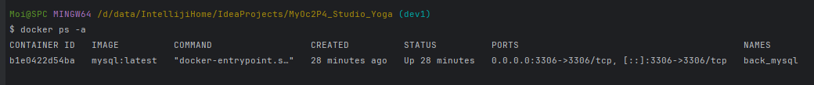
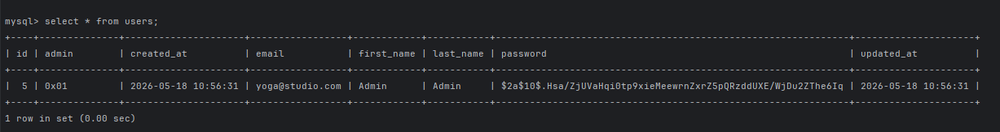
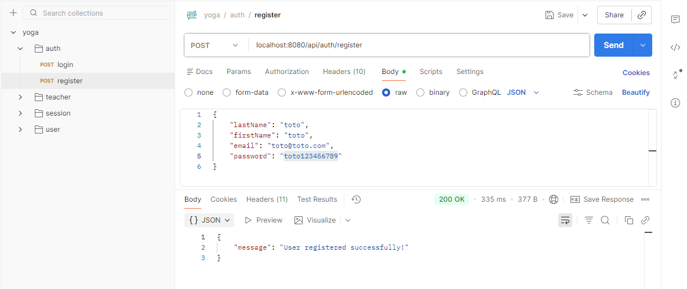
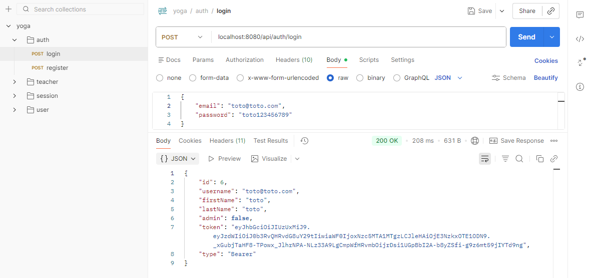
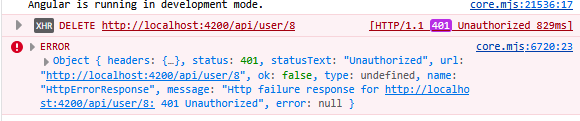

# dev1 < mymain
1) Source l'environnement : 
> $ . ./.env
2) Démarrer l'application :
> $ mvn spring-boot:run

3) Vérification Docker:
> $ docker ps -a  

4) Vérification base :
>  select * from users;

5) import postman/yoga.postman_collection.json : 
> Test  Api : http://localhost:8080/api/auth/register

> Test Api POST : http://localhost:8080/api/auth/login

# dev2 : 
- Mise en place d’une gestion
  Implémentation : 
  - payload/response/ErrorResponse.java
  - exception/UnauthorizedException.java
  - exception/GlobalExceptionHandler.java
Screenshot Erreur :
  