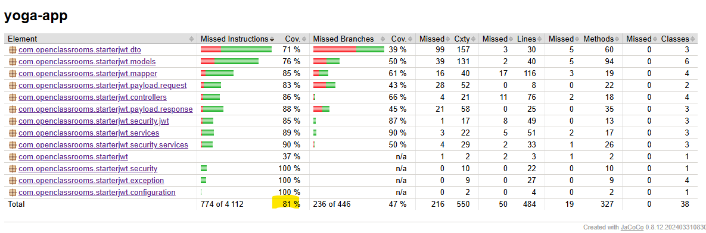
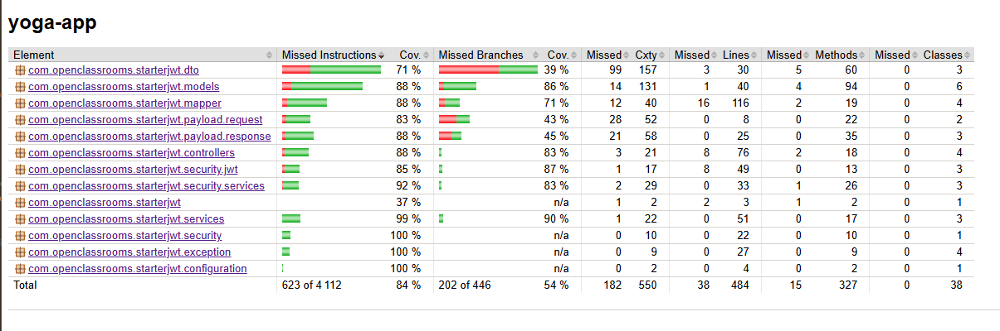
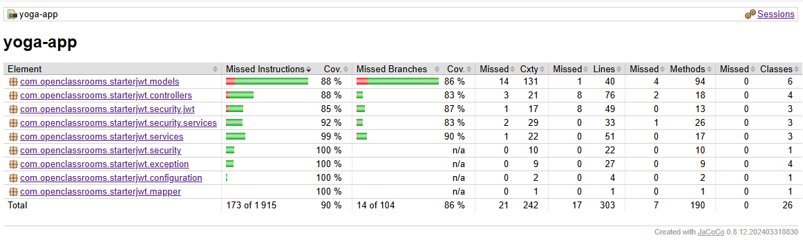

# dev1 < mymain
1) Source l'environnement : 
> $ . ./.env
2) Démarrer l'application :
> $ mvn spring-boot:run

3) Vérification Docker:
> $ docker ps -a  

4) Vérification base :
>  select * from users;

5) import postman/yoga.postman_collection.json : 
> Test  Api : http://localhost:8080/api/auth/register

> Test Api POST : http://localhost:8080/api/auth/login

# dev2 : 
- Mise en place d’une gestion
  Implémentation : 
  - payload/response/ErrorResponse.java
  - exception/UnauthorizedException.java
  - exception/GlobalExceptionHandler.java

# dev3
- Le respect du découpage de l’application en plusieurs couches
  Refactor : UserService, UserController

# dev4
- Les traitements métiers déportés dans les classes de service métier
  Refactor : SessionController, SessionService

# dev5
- Implémentation des tests :

# dev6
Amélioration Test  

# dev7
Exlusion des tests tout élément DTO et la classe principale
Refactor : pom.xml

# solution_back < dev7
Renommer Myreadme.md en README_BACK.md

# main < merge 
